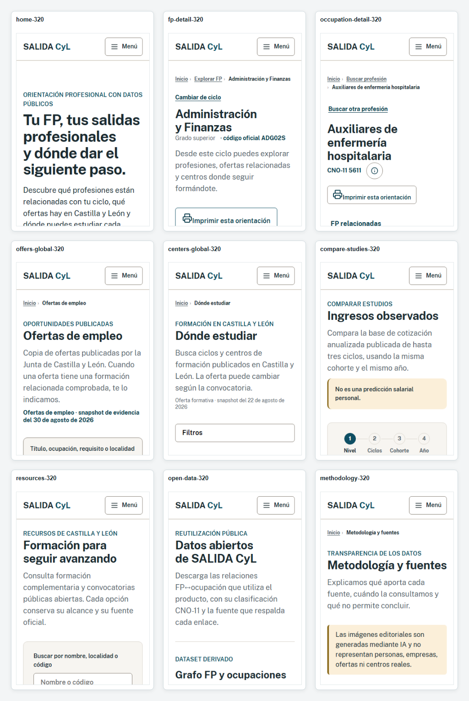
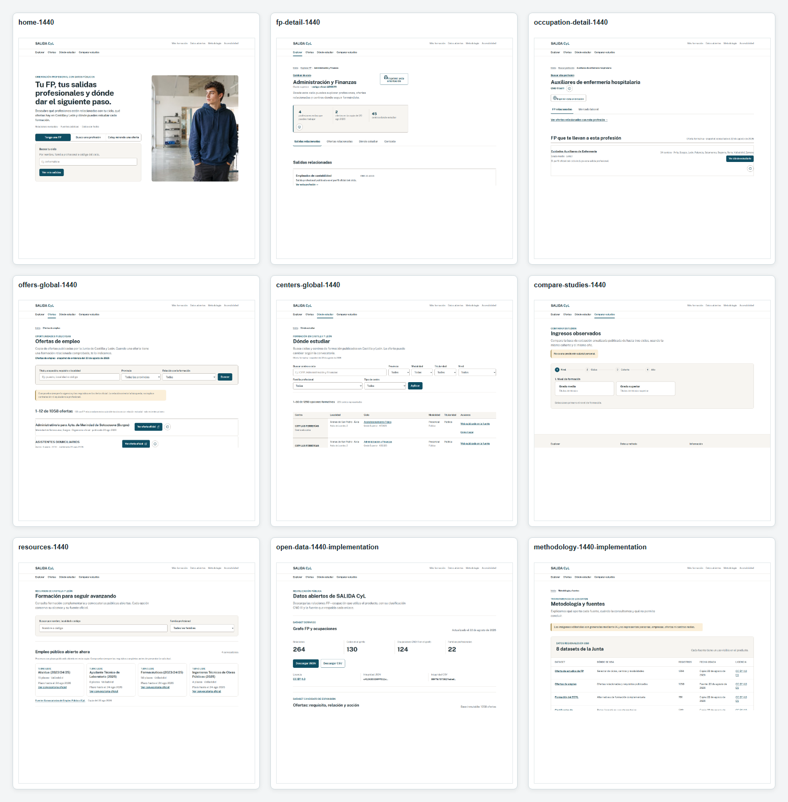

# SALIDA CyL — design-system normalization closure

Fecha de cierre: 2026-09-03  
Rama: `feature/competition-visual-redesign-implementation`  
Alcance: normalización de sistema visual, auditoría reproducible y evidencia para revisión humana. No se hizo push, deploy ni release candidate.

## 1. BEFORE_METRICS

La medición BEFORE se capturó contra el preview del build de producción, antes de modificar el CSS, con 9 rutas y 4 viewports (`320`, `390`, `768`, `1440`): 36 muestras.

- Gutters móviles: 2 variantes de borde izquierdo (`16`, `32`) y 4 variantes de borde derecho (`288`, `304`, `358`, `374`).
- H1 interior: 1 familia (`Inter`), 2 pesos (`700`, `760`), 12 tamaños computados.
- Eyebrow: 6 estilos computados.
- Controles: 3 estados de familia (`Public Sans`, `Inter`, vacío), 6 pesos y 11 alturas.
- Paneles: radios `0/6/10/14px` y 7 valores de padding izquierdo.
- Overflow horizontal: no se convirtió en un gate BEFORE; se conserva en la repetición AFTER.

Detalle completo: `design-system-normalization-before.json` y `design-system-normalization-before.md`.

## 2. CSS_ROOT_CAUSES

- Gutters anidados: shell, `.container` y raíces de página competían por el borde del canvas.
- Max-widths y paddings locales creaban canvases interiores distintos en FP, Occupation, Resources y Open Data.
- `visualRefresh.css` imponía la familia Inter sobre el contrato Public Sans.
- Los títulos, eyebrows, ledes, controles y paneles se redefinían por ruta en lugar de por rol.
- Las tabs de Occupation heredaban el tratamiento genérico de controles con caja.
- La grid de Methodology expresaba los roles por orden de fuente y no por spans semánticos explícitos.

El mapa selector → causa → contrato está en `../css-legacy-normalization-audit.md`.

## 3. LEGACY_RULES_REMAINING

`visualRefresh.css` se conserva. Siguen siendo válidos su header, navegación, breadcrumbs, footer, focus y comportamiento responsive. Las reglas normalizadas de `salida.css` establecen el contrato compartido después de las hojas de feature.

Permanecen reglas locales únicamente cuando preservan significado, orden de evidencia, datos, responsive behavior o composición editorial. La existencia de un selector legacy no se considera fallo si su valor computado ya no produce una divergencia no aprobada.

## 4. GLOBAL_GRID

PASS en el gate de gutter móvil: varianza `0.00px`. El contrato queda en `--page-gutter`: `16px` hasta `767px` y `24px` desde `768px`; a `1440px` las muestras comparten canvas `100 / 1340` (`1240px`). Header, main, footer, breadcrumbs, mastheads, filtros y resultados comparten ese propietario.

## 5. TYPOGRAPHY

PASS para el contrato interior. Los H1 usan Public Sans, peso `700` y el token único `clamp(1.75rem, 1.5rem + .8vw, 2rem)`. Los tamaños computados `28`, `30.144` y `32px` son la expresión responsive del mismo token. Home conserva deliberadamente su rol editorial `--type-display-home`.

## 6. EYEBROW

PASS: una única firma computada para los eyebrows presentes: Public Sans, `14px`, peso `600`, uppercase, letter-spacing `0.14px`, color primario. Se añadió `PageEyebrow` como primitive. FP y Occupation result no lo repiten porque el breadcrumb ya nombra explícitamente el contexto de la journey.

## 7. MASTHEAD

PASS como base compartida mediante `.page-masthead`, con slots opcionales para breadcrumb, eyebrow, H1, lede, metadata y actions. No se añadió copy ni se alteró la secuencia de la evidencia.

## 8. BREADCRUMBS

PASS en consistencia: un único separador generado (`›`) cuando hay breadcrumb; el separador permanece unido al siguiente crumb y la etiqueta actual puede envolver internamente. Las páginas top-level sin breadcrumb son una excepción intencional. La vista Occupation a 320px fue inspeccionada tras la corrección.

## 9. PANELS

PASS para la geometría aprobada. Los roles usan `--radius-panel`, `--radius-card`, `--panel-padding-sm` y `--panel-padding-md`, además de `--radius-control` para controles. Se conservan variantes deliberadas entre panel, card, callout, evidence y metodología; no se impuso un tamaño único a todas las cards.

## 10. METHODOLOGY_GRID

PASS: los dos bloques estadísticos tienen rol explícito y span de seis columnas; los bloques complementario, catálogo y derivado usan spans de ancho completo/read-width. La captura desktop muestra bordes derechos alineados y la tarjeta regional de datasets ocupa el ancho esperado.

## 11. RESOURCES

PASS como integrante del sistema compartido: masthead, filtros, gutter, paneles, cards, jerarquía y ritmo usan los mismos roles que el resto de las páginas interiores. Se mantienen los datos y comportamientos existentes, incluidos `791/583/4`, búsqueda, familias, mostrar más y fuente.

## 12. OCCUPATION_TABS

PASS: `ResultSectionNav` expone estado activo mediante `aria-current="location"`, mantiene estados inactive/hover/active/focus-visible y conserva print como acción secundaria. La interacción de click y la actualización por IntersectionObserver tienen test unitario dedicado.

## 13. HOME_ALIGNMENT

PASS en alineación exterior y convivencia editorial: el home conserva su H1 display y su imagen real, pero comparte gutter, shell, tipografía base, controles y footer con el resto del producto. La captura `home-1440.png` y la vista larga `home-390-long.png` fueron inspeccionadas.

## 14. OPEN_DATA_LABELS

PASS semántico. La evidencia runtime confirmó que `130` y `124` son subconjuntos del grafo derivado publicado; por eso se cambiaron sólo las etiquetas a `Ciclos en el grafo` y `Ocupaciones CNO-11 en el grafo`. Los valores no cambiaron. La captura mantiene visibles los contadores y las descargas.

## 15. AFTER_METRICS

La repetición exacta del audit produjo 36 muestras y todos los gates pasan:

| Gate                               | Resultado       |
| ---------------------------------- | --------------- |
| `MOBILE_OUTER_GUTTER_VARIANCE`     | PASS (`0.00px`) |
| `INTERIOR_H1_FONT_FAMILY_VARIANTS` | PASS (`1`)      |
| `INTERIOR_H1_FONT_WEIGHT_VARIANTS` | PASS (`1`)      |
| `INTERIOR_H1_TOKEN_VARIANTS`       | PASS (`1`)      |
| `EYEBROW_STYLE_VARIANTS`           | PASS (`1`)      |
| `CONTROL_FONT_FAMILY_VARIANTS`     | PASS (`1`)      |
| `NO_HORIZONTAL_OVERFLOW`           | PASS (`0`)      |
| `AUDIT_SAMPLE_COUNT`               | PASS (`36`)     |

Firmas restantes y excepciones: `design-system-normalization-after.md` y `design-system-normalization-after.json`.

## 16. SCREENSHOTS

Se generaron contra el production build: 30 capturas de rutas/footer y 2 hojas de contacto. La matriz incluye todos los 320px, los 390px completos, los 1440px completos y las dos evidencias contextuales adicionales `offers-contextual-320.png` y `centers-contextual-320.png`.

También queda `footer-ai-disclosure.png`; la frase `Imágenes editoriales generadas mediante IA.` fue inspeccionada visualmente.

## 17. TESTS

- Unit: `1298 passed`, `178 skipped`; `130` test files passed and `22` skipped.
- Typecheck: PASS.
- Lint: PASS.
- Format: PASS.
- License policy: PASS (`363` locked package entries).
- Build: PASS; runtime snapshot `20260830120000000-8c6c79fbd2a1`.
- Asset budget: PASS (`3,498,233 / 3,600,000` raw bytes, 77 files).
- Distribution: PASS (`22` manifest resources, `25` data files, `22,712,737` raw bytes, `0` duplicates).
- Candidate boundary: PASS (`22` resources, `116` SEPE records).
- Data integrity: PASS (`14/14`).

## 18. E2E

PASS: `176/176` Chromium E2E. Incluye rutas deep-link, estados de navegación, walkthrough de jury, interacción de tabs, keyboard reachability, Axe y overflow a 320px.

## 19. AXE

PASS dentro de la suite E2E. No se actualizaron snapshots visuales para ocultar regresiones; el gate de Axe y el recorrido de teclado permanecen verdes.

## 20. GIT_DIFF

El worktree queda limpio en la rama indicada. `git diff --check` pasa. La normalización de producto se concentró en 30 archivos fuente rastreados; la evidencia añade los reportes BEFORE/AFTER, el audit CSS, tres runners de QA, 30 PNG y 2 contact sheets.

## 21. COMMITS

Commits locales creados, sin push:

1. `refactor(ui): normalize layout and typography primitives`
2. `refactor(ui): unify interior mastheads and panels`
3. `fix(ui): make result tabs announce active location`
4. `chore(qa): add visual-system normalization evidence`

## 22. REMAINING_VISUAL_DEVIATIONS

No se declara “visualmente perfecto” ni se puntúa el resultado. Quedan para la revisión humana, como decisiones conscientes y no como blockers técnicos:

- Home mantiene una identidad más editorial y su display title propio.
- Los tamaños computados cambian con el viewport porque el token H1 es fluido.
- Paneles, cards, callouts y evidence conservan radios/paddings distintos por función.
- Algunas páginas top-level no tienen breadcrumb; FP/Occupation result no duplican eyebrow; Occupation result no añade lede.
- Las hojas legacy conservan reglas válidas y excepciones de feature; no se hizo una purga ciega de `visualRefresh.css`.
- Las contact sheets son ayudas de comparación; la aceptación estética requiere inspección humana de las capturas completas.

GLOBAL_GRID_NORMALIZED: PASS  
TYPOGRAPHY_NORMALIZED: PASS  
EYEBROW_NORMALIZED: PASS  
MASTHEAD_NORMALIZED: PASS  
BREADCRUMBS_NORMALIZED: PASS  
PANEL_GEOMETRY_NORMALIZED: PASS  
METHODOLOGY_COMPOSITION: PASS  
RESOURCES_VISUAL_SYSTEM: PASS  
OCCUPATION_TABS: PASS  
OPEN_DATA_SEMANTICS: PASS  
FULL_TEST_SUITE: PASS  
READY_FOR_HUMAN_VISUAL_REVIEW: YES  
READY_FOR_RELEASE_CANDIDATE: NO

No push.  
No deploy.  
No release.
