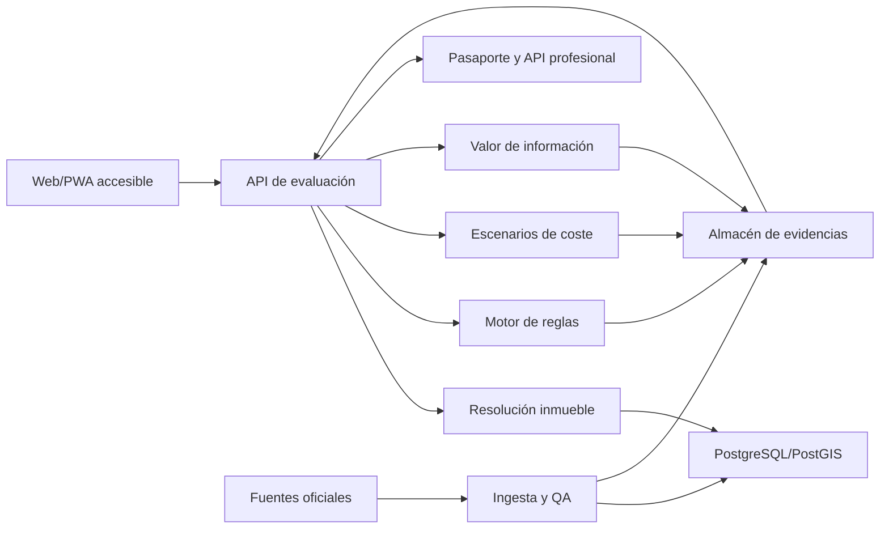

# Estrategia ganadora para los Premios Datos Abiertos de Castilla y León 2026

**Fecha de corte:** 2 de agosto de 2026  
**Categoría recomendada:** Productos y Servicios  
**Ganador propuesto:** **Casa Clara CyL - Decide antes de firmar**

## Veredicto ejecutivo

La apuesta con mayor probabilidad de premio no es otro recomendador de municipios, mapa de servicios, dashboard, asistente genérico o predictor sanitario. Es **Casa Clara CyL**, un pasaporte de decisión gratuito para una vivienda concreta: antes de pagar una señal, firmar arras, alquilar o iniciar una rehabilitación, la persona introduce la dirección o referencia catastral, su uso previsto y unas pocas prioridades. El sistema cruza datos oficiales y devuelve una postura accionable: **seguir**, **seguir con condiciones**, **negociar**, **investigar primero** o **descartar**, junto con el coste total probable del primer año, las ayudas aplicables, los riesgos, las evidencias y la comprobación adicional que más puede cambiar la decisión.

La innovación diferencial es el **motor de valor de la información**: no finge saber lo que los datos no permiten saber. Identifica la incertidumbre material y recomienda la siguiente comprobación con mayor capacidad de evitar una mala compra: pedir un certificado, medir radón, consultar a Urbanismo, encargar una inspección o verificar una restricción. Esto convierte datos dispersos en una decisión de alto coste, explicable y medible.

La probabilidad estimada de terminar entre los tres mejores proyectos es **61%**, condicionada a entregar un MVP público y estable, probar al menos 25 viviendas reales, documentar entrevistas con compradores y profesionales, y cubrir accesibilidad y trazabilidad. Si se presenta solo como idea o maqueta, la estimación cae a **22%**.

---

## 1. Reglas 2026: qué puntúa y qué puede excluir

La convocatoria está abierta del **22 de julio al 21 de septiembre de 2026**. La [página oficial del X Concurso](https://datosabiertos.jcyl.es/web/es/concurso-datos-abiertos/concurso-datos-abiertos.html), el [extracto BOCYL](https://bocyl.jcyl.es/boletines/2026/07/21/pdf/BOCYL-D-21072026-139-17.pdf) y la [Sede Electrónica IAPA 2377](https://www.tramitacastillayleon.jcyl.es/web/jcyl/AdministracionElectronica/es/Plantilla100Detalle/1251181050732/Premio/1285664800452/Propuesta) son las fuentes operativas.

### Criterios y peso

En Productos y Servicios hay siete criterios y **todos pesan igual**; no existe una puntuación numérica publicada. En la práctica, cada criterio representa aproximadamente una séptima parte de la defensa:

| Criterio | Qué debe demostrar Casa Clara CyL |
|---|---|
| Utilidad | Resuelve una decisión cara y frecuente; evita costes, retrasos y compras incompatibles con el uso previsto. |
| Valor económico | Ahorro potencial para compradores y rehabilitadores; API profesional y capacidad de activar vivienda infrautilizada. |
| Valor público/social | Reduce asimetría de información, facilita rehabilitación, combate pobreza energética y hace comprensibles los datos públicos. |
| Originalidad e innovación | Primera capa de decisión pre-arras basada en fuentes públicas de Castilla y León, con valor de la información e incertidumbre explícita. |
| Variedad de datasets | Varios conjuntos JCyL más Catastro, riesgos naturales, patrimonio, planeamiento y conectividad. |
| Facilidad de uso/accesibilidad | Dirección o referencia catastral, resultado en lenguaje claro, móvil, WCAG 2.2 AA y modo lectura fácil. |
| Calidad técnica | Uniones geoespaciales auditables, reglas versionadas, control de frescura, pruebas y observabilidad. |

### Condiciones obligatorias

- Usar al menos una fuente publicada en el Portal de Datos Abiertos de la Junta; incumplirlo excluye. Se pueden combinar fuentes públicas o privadas de cualquier ámbito.
- El proyecto no debe haber sido premiado anteriormente. Desde la reforma de 2021 ya no se exige que sea temporalmente inédito.
- Productos y Servicios debe ser accesible a toda la ciudadanía mediante una URL.
- La memoria tiene un máximo de **1.000 palabras** y debe aportar evidencia para los criterios; los méritos no documentados no se valoran.
- Una persona puede presentar varios proyectos y el mismo proyecto a varias categorías, pero solo puede ganar una.
- Personas físicas y jurídicas pueden concurrir; no se exige residencia en Castilla y León. Administraciones públicas y quienes participaron en las bases no pueden presentarse.
- Los proyectos premiados siguen perteneciendo a sus autores. Debe mencionarse el premio en usos posteriores y aceptarse formalmente en cinco días hábiles tras la notificación.

### Oportunidades ocultas en las bases

1. **Un MVP ya desplegado es una ventaja reglamentaria.** No hay que esperar a que el producto esté “terminado para el concurso”; puede llegar con uso real mientras no haya recibido otro premio.
2. **La memoria debe funcionar como matriz de pruebas.** Siete criterios de igual peso implican siete mini-casos demostrados, no una narrativa centrada solo en impacto o IA.
3. **La variedad regional vale doble estratégicamente.** Las fuentes externas son legales, pero varios datasets JCyL hacen visible el valor del portal que convoca.
4. **La URL viva evalúa tres veces.** Es requisito de categoría, prueba de facilidad de uso y evidencia de calidad técnica.
5. **El jurado puede declarar premios desiertos.** La candidatura debe superar un umbral de credibilidad, no solo ser comparativamente mejor.

---

## 2. Palmarés I-IX y saturación competitiva

Las fuentes oficiales publican ganadores, pero no actas con puntuación, motivación individual ni inventario completo de datasets. Por eso, “por qué ganó” se marca como **inferencia**, y “datasets” como no publicado cuando no existe evidencia verificable. El [índice oficial de ediciones](https://datosabiertos.jcyl.es/web/es/concurso-datos-abiertos/ediciones-anteriores.html) y las órdenes BOCYL sustentan el palmarés.

| Edición | Proyectos premiados | Datos publicados | Usuarios e innovación | Por qué pudo ganar (inferencia) | Debilidad actual / saturación |
|---|---|---|---|---|---|
| I, 2013 | APCYL; Clic & Fish; Juvecyl; mención Map4RDF-iOS | No inventariados | Alérgicos, pesca y jóvenes; primeras apps móviles útiles | Utilidad inmediata y novedad móvil en una etapa temprana del portal | Polen, pesca y localizadores ya han reaparecido; riesgo alto si solo se actualiza la interfaz |
| II, 2014-15 | Empleo JCYL; Vehículo eléctrico CyL; Conquista Castilla y León; mención cyljob | El palmarés solo describe ofertas/oficinas y puntos de recarga | Demandantes de empleo, conductores y turistas | Decisiones claras y geolocalización práctica | Empleo, recarga y turismo están muy saturados |
| III, 2018-19 | Gestión inteligente de energía; SEMFOD; OxigenaT; Juega CyL; Planrepuebla; NaturCyL; Laboratorio de datos; Evolución de población; Agromapa | No inventariados | Gestores de edificios, sector forestal, estudiantes, nuevos residentes, visitantes | Mezcla de analítica, personalización, educación y producto funcional | Energía, repoblación, naturaleza, población y gamificación se han repetido mucho |
| IV, 2020 | Castilla y León en remoto; CYL MOVILIDAD; Escovid19data; Castilla y León Gurú; TurisCyL; Casual Learn; dos piezas COVID | No inventariados | Teletrabajadores, movilidad reducida, ciudadanía en pandemia, turistas y estudiantes | Respuesta oportuna a COVID y productos accesibles | COVID quedó obsoleto; municipio ideal, asistentes y turismo son arquetipos maduros |
| V, 2021 | APP SOLAR-CYL; Donde Te Esperan; Repuéblame; Plagrícola; disCAPACIDAD.es; Ruta x Ruta; dos piezas periodísticas; menciones APP BOCYL/COVID CyL | No inventariados | Autoconsumo, consumidores locales, repobladores, agricultores, discapacidad | Acción práctica para segmentos definidos | Repoblación, agricultura, rutas y energía ya tienen muchos precedentes |
| VI, 2022 | Elige tu Universidad; BODI; Oferta FP no-code; Enjoycyl; p-mediana en Atención Primaria; Play4CyL; GeoChef; dos piezas electorales | No inventariados | Estudiantes, reutilizadores, gestores sanitarios, visitantes | Decisiones educativas y optimización real, no solo información | Educación, bots, cultura, salud y ocio ya tienen ganadores directos |
| VII, 2023 | Oferta sanitaria/Dashboard; Toponimia oral; EnergyCyl; Territorios Activos; anomalías logísticas; ofertas jóvenes; CHEST; vida sin bar | No inventariados | Ciudadanía, investigadores, logística, jóvenes y docentes | Cobertura territorial y combinación técnica de datos | Dashboard sanitario, ruralidad, energía y directorios presentan saturación alta |
| VIII, 2024 | Guardianes Verdes; ParkNature; AquaCyL; ConquistaCyL; Todo el deporte; Otto Wunderlich; StartUp CyL; caza en Burgos | No inventariados | Visitantes de naturaleza, bañistas, turistas, deportistas y estudiantes | Productos terminados, nichos concretos y experiencia móvil | Naturaleza, turismo, cultura y gamificación dominaron; repetirlos exigiría un mecanismo nuevo |
| IX, 2025 | CyL Rural Hub; app cultural; PuenteCyL; MuniCyL; mapa de espacios naturales; Info Salamanca; enseñanza de datos; infartos jóvenes; eólica Burgos | No inventariados | Residentes rurales, nuevos residentes, ciudadanía local, docentes y lectores | Utilidad territorial y productos vivos | Municipio ideal, rural hub, asistentes, mapas, cultura y salud quedaron especialmente saturados |

### Temas que conviene descartar salvo giro radical

- Recomendador de municipio, repoblación o “mejor lugar para vivir”.
- Turismo, rutas, patrimonio, naturaleza o agenda cultural.
- Dashboard sanitario, energético, demográfico o presupuestario.
- Chatbot o asistente generalista sobre el catálogo, BOCYL, ayudas o turismo.
- Empleo, FP, oposición o alerta de convocatoria sin inteligencia de decisión.
- Localizador de puntos de recarga, DESA, servicios o establecimientos sin priorización.

Casa Clara se mantiene lejos del patrón “elige municipio”: empieza cuando la persona **ya tiene una vivienda concreta** y debe decidir qué hacer antes de comprometer dinero.

---

## 3. Catálogo: activos de datos y combinaciones valiosas

La API del portal de análisis devolvía 430 datasets el 2 de agosto de 2026. “Inusual” significa granular o poco representado en el palmarés, no que la Junta publique un índice de baja reutilización.

| Dataset oficial | Valor | Limitación que el producto debe mostrar |
|---|---|---|
| [Certificados de Eficiencia Energética](https://analisis.datosabiertos.jcyl.es/explore/dataset/certificados-de-eficiencia-energetica/information/) | Más de 343.000 registros, referencia catastral, dirección, demanda, consumo, emisiones y coordenadas; actualización diaria | No equivale a inspección del estado actual; puede haber certificados caducados o varias versiones |
| [Instalaciones de calefacción y ACS con sala de calderas](https://analisis.datosabiertos.jcyl.es/explore/dataset/calderas/information/) | Ubicación, combustible, potencia y tipo de instalación | Cobertura parcial; no debe inferirse que toda vivienda sin registro carece de calefacción |
| [Convocatorias de ayudas y subvenciones](https://analisis.datosabiertos.jcyl.es/explore/dataset/ayudas-y-subvenciones/information/) | Requisitos, plazos, beneficiarios y actuaciones de rehabilitación/energía/accesibilidad | El texto requiere normalización y reglas por vigencia; la app no concede la ayuda |
| [Trámites](https://analisis.datosabiertos.jcyl.es/explore/dataset/tramites/information/) | Procedimientos, requisitos, formularios, normativa y pasos | No sustituye la consulta urbanística municipal ni el criterio profesional |
| [BOCYL](https://analisis.datosabiertos.jcyl.es/explore/dataset/bocyl/information/) | Normativa y cambios; más de 61.000 registros indexados | Debe filtrarse por vigencia y ámbito; un LLM no puede decidir validez por sí solo |
| [Calidad del agua de consumo humano](https://analisis.datosabiertos.jcyl.es/explore/dataset/calidad-de-las-aguas-de-consumo-humano/information/) | Infraestructuras, aptitud e incumplimientos; actualizado en 2026 | Agregación provincial/anual insuficiente para afirmar la calidad de un grifo concreto |
| [Incidencias en carreteras autonómicas](https://analisis.datosabiertos.jcyl.es/explore/dataset/incidencias-en-la-red-de-carreteras-titularidad-de-la-junta-de-castilla-y-leon/information/) | Vía, PK, causa, alternativa; actualización cada 10 minutos | Solo red autonómica; útil como contexto de resiliencia, no como garantía de acceso |
| [Servicios de proximidad](https://analisis.datosabiertos.jcyl.es/explore/dataset/servicios-proximidad/information/) | Contexto de servicios públicos cercanos | Cercanía no implica horario, plaza disponible o calidad |
| [Centros de salud por municipio](https://analisis.datosabiertos.jcyl.es/explore/dataset/centros-de-salud-municipios/information/) y [Directorio de centros docentes](https://analisis.datosabiertos.jcyl.es/explore/dataset/directorio-de-centros-docentes/information/) | Cobertura de necesidades cotidianas y familiares | No deben dominar la recomendación ni convertirla en ranking municipal |
| [Inventario de bienes y derechos](https://analisis.datosabiertos.jcyl.es/explore/dataset/inventario-de-bienes-y-derechos/information/) | Inmuebles públicos y uso | No describe vivienda privada ni disponibilidad para reutilización |

### Fuentes externas justificadas para Casa Clara

| Fuente | Función | Regla de prudencia |
|---|---|---|
| Catastro INSPIRE / Sede del Catastro | Resolver referencia, parcela, geometría, uso y antigüedad cuando estén disponibles | No exponer datos personales ni sustituir una certificación catastral |
| SIUCyL/IDECyL y planeamiento municipal | Clasificación de suelo, instrumentos y afecciones disponibles | Marcar cobertura y remitir a cédula/consulta urbanística |
| MITECO/SNCZI | Peligrosidad y riesgo de inundación | “Intersección cartográfica” no equivale a informe hidráulico de parcela |
| CSN - mapa de potencial de radón | Riesgo de zona y prioridad de medición | No diagnosticar concentración dentro del edificio |
| MITECO/INFOCAL/Copernicus | Peligro de incendio, interfaz urbano-forestal y antecedentes | Separar peligro territorial de vulnerabilidad constructiva |
| Catálogo de Patrimonio/IDECyL | Bienes protegidos y entornos de protección | Confirmar con el órgano competente; la ausencia en el cruce no es garantía jurídica |
| Ministerio de Transformación Digital | Cobertura de banda ancha por tecnología | Cobertura declarada no garantiza velocidad en el domicilio |
| INE y MITMA | Contexto de mercado y costes de construcción/rehabilitación | Usar intervalos, nunca una tasación automática |

### Intersecciones especialmente prometedoras fuera del ganador

1. DESA fijos y móviles + emergencias + incidencias viarias + población/ZBS: priorizar brechas de respuesta cardiaca.
2. Actividad diaria por consultorio + consultas domiciliarias + TSI/profesional + presión asistencial: planificar refuerzos concretos.
3. Bibliobuses + horarios/incidencias + servicios/demografía: convertir una red móvil existente en infraestructura de acceso.
4. Edad/sexo de solicitantes PAC + cultivos municipales + agua + FP + ayudas: relevo agrario accionable.
5. Consumos horarios en 27 hospitales + precios + clima + instalaciones: flexibilidad energética y detección de anomalías.

---

## 4. Inspiración internacional: mecanismos, no copias

| Caso | Problema y usuario | Innovación / mecanismo transferible | Qué no copiar | Principio adaptable |
|---|---|---|---|---|
| [renEUwable, EU Datathon 2022](https://data.europa.eu/en/news-events/news/meet-winners-eu-datathon-2022) | Hogares que deben elegir medidas de ahorro | Prioriza acciones personalizadas y beneficio estimado | Consejos energéticos genéricos | Decisión ordenada y explicable |
| [Hermix, EU Datathon 2022](https://data.europa.eu/en/news-events/news/eu-datathon-2022-teams-behind-apps-meet-hermix) | Pymes ante contratación pública | Normaliza fuentes y estima encaje, oportunidad y siguiente acción | Otro buscador de licitaciones | El modelo de dominio es más valioso que la interfaz |
| [PRADOS, U.S. Census TOP](https://opportunity.census.gov/prados/) | Direcciones locales incompatibles con estándares | Gobernanza y corrección del dato con conocimiento territorial | Imponer un esquema que borre contexto | El producto puede mejorar el dato que consume |
| [Sille, U.S. Census TOP](https://opportunity.census.gov/sille/) | Gestores de emergencia priorizan inspecciones | Sentinel-1 + censo para una cola de triaje | Diagnóstico estructural automatizado | Decir dónde actuar primero y con qué incertidumbre |
| [Proceso TOP](https://opportunity.census.gov/sprint-process/) | Prototipos separados de usuarios y organismos | Usuario afectado + custodio del dato + implantador en sprint | Hackathon sin continuidad | Piloto y propietario operativo desde el MVP |
| [Re-Fill City, Taiwán](https://presidential-hackathon.taiwan.gov.tw/en/international-track/index.html) | Reducir botellas de un solo uso | Recomendación + infraestructura + incentivo + telemetría | Mapa sin mantenimiento ni acción | Bucle físico verificable |
| FarmABetterFish, Taiwán | Acuicultores deciden tarde | Dato público contextual + sensores + protocolo | IoT decorativo | Sensor solo si cierra una brecha de decisión |
| [newRoots, Canadá](https://www.canada.ca/en/news/archive/2014/03/team-from-ontario-wins-code-top-prize.html) | Nuevos residentes eligen ciudad | Recomendador multicriterio de decisión vital | Otro “municipio ideal” | Mantener la arquitectura, cambiar a una decisión no saturada |
| [Yadokari-kun, Tokio](https://odhackathon.metro.tokyo.lg.jp/collection/2023/) | Hogares no conocen prestaciones | Reglas auditables, elegibilidad y cuantía | Chatbot opaco o resolución automática | Simular y activar un derecho con límites visibles |
| [Shipping Note, Corea](https://www.nia.or.kr/site/nia_kor/ex/bbs/View.do?bcIdx=27274&cbIdx=27974&parentSeq=27274) | Empresas siguen transporte y aduanas | Reconstruye un proceso longitudinal y su siguiente paso | Agregador de estados | Diseñar alrededor del viaje, no del organismo |
| [data.gov.sg](https://reports.open.gov.sg/datagovsg/overview) | Reutilizadores necesitan fiabilidad | Métricas públicas, frescura y contrato de servicio | Otro catálogo | Medir disponibilidad, cobertura, adopción y coste |
| [BlindSquare, Finlandia](https://hri.fi/2years/3-apps4finland.html) | Personas ciegas se orientan | Datos geográficos + capacidades nativas del móvil | Diseñar tecnología antes de conocer al usuario | Accesibilidad como función central |
| [MyHelsinki Open API](https://hri.fi/en_gb/best-open-data-initiative-of-2018-shares-helsinkis-data-to-a-billion-users/) | Pequeños negocios no distribuyen información | Aportación local + validación + API multicanal | Otra guía turística | Llevar el dato al canal donde se decide |
| [data.norge.no hackathon](https://www.digdir.no/datadeling/hackathon-pa-datanorgeno-apen-kildekode-og-crowdsourcing-i-praksis/6359) | Publicar metadata exige esfuerzo | Código abierto, validación y contribuciones integrables | Sprint sin equipo propietario | Ruta explícita de demo a producción |

Patrón común: **decisión estrecha + normalización difícil + explicación + acción física/administrativa + medición de resultado**.

---

## 5. Veinte conceptos y descarte crítico

Escalas: 1 es bajo y 10 es alto. En saturación, 10 es peor.

| # | Concepto | Originalidad | Impacto | Factibilidad | Datos principales | Ventaja competitiva | Novedad | Saturación | Veredicto |
|---:|---|---:|---:|---:|---|---|---:|---:|---|
| 1 | **Casa Clara CyL**: decisión pre-arras/rehabilitación para una vivienda concreta | 9 | 9 | 8 | CEE, calderas, ayudas, trámites, BOCYL, Catastro, riesgos | Referencia catastral + reglas + valor de información | 9 | 3 | Finalista 1 |
| 2 | **Pulso 15**: priorizar instalación, accesibilidad y verificación de DESA | 9 | 10 | 7 | DESA fijos/móviles, emergencias, carreteras, población | Optimiza cobertura real, no localiza | 9 | 4 | Finalista 2 |
| 3 | **Puentes Primero**: cola explicable de inspección de puentes | 9 | 9 | 5 | Inventario, tráfico, incidencias, Sentinel-1 | Triaje preventivo con incertidumbre | 9 | 2 | Finalista 3 |
| 4 | **BiblioNodo**: optimizar bibliobuses como última milla de acceso público | 9 | 8 | 6 | Horarios, incidencias, demografía, servicios | Reutiliza infraestructura móvil existente | 9 | 2 | Finalista 4 |
| 5 | **EIA Previo**: preevaluación de localización y permisos para microempresas | 8 | 8 | 6 | EIA/EAE, trámites, BOCYL, planeamiento, patrimonio | Reduce error antes de alquilar/comprar suelo | 8 | 3 | Finalista 5 |
| 6 | Consulta Justa: priorizar refuerzos de Atención Primaria | 7 | 10 | 7 | Actividad por consultorio, TSI, presión, población | Capacidad diaria, no mapa sanitario | 8 | 6 | Rechazado: adopción y precedente sanitario |
| 7 | HospitalFlex: acciones horarias de ahorro energético | 7 | 9 | 8 | Consumos horarios, clima, precio, instalaciones | Ahorro medible por centro | 7 | 7 | Rechazado: energía muy premiada |
| 8 | CuidaPlan: paquete personalizado para cuidados de larga duración | 7 | 10 | 6 | Dependencia, servicios, centros, transporte | Convierte oferta dispersa en plan familiar | 7 | 6 | Rechazado: disponibilidad real no publicada |
| 9 | CalorCuida: rutas de atención domiciliaria durante calor extremo | 8 | 10 | 5 | Dependencia, servicios, carreteras, AEMET | Protocolo de visita priorizada | 8 | 5 | Rechazado: datos personales e implantación |
| 10 | Ruta Vital 72: plan B para acceso a servicios en incidentes | 8 | 9 | 5 | Incidencias, red viaria, salud, transporte | Alternativa anticipada por hogar | 8 | 5 | Rechazado: cobertura viaria incompleta |
| 11 | AgroRelevo: itinerario de sucesión/formación/diversificación | 7 | 9 | 7 | PAC por edad, cultivos, FP, ayudas | Decisión agraria, no municipio | 7 | 7 | Rechazado: ruralidad y relevo ya concurren |
| 12 | Parcela Resiliente: diligencia previa a invertir en suelo agrario | 7 | 9 | 6 | SIGPAC, cultivos, agua, clima, EIA | Riesgo de inversión a escala parcela | 7 | 6 | Rechazado: complejidad agronómica y datos externos |
| 13 | Escuela a Tiempo: dónde ajustar rutas y apoyos escolares | 8 | 8 | 6 | Centros, alumnado, transporte, población | Decisión operativa anual | 8 | 4 | Rechazado: necesita datos de matrícula/rutas más finos |
| 14 | Residuo Sin Riesgo: ruta de cumplimiento para pequeños negocios | 8 | 7 | 7 | Gestores, trámites, BOCYL, establecimientos | Próxima acción regulatoria y gestor compatible | 8 | 3 | Reserva: problema menos emocional |
| 15 | Activo Público Vivo: priorizar reutilización de inmuebles públicos | 8 | 8 | 6 | Inventario, cesiones, energía, servicios | De inventario a cartera de reutilización | 8 | 3 | Rechazado: disponibilidad/estado no publicados |
| 16 | Ayuda Exacta: simulador de derechos y cuantías | 6 | 10 | 8 | Ayudas, trámites, BOCYL | Reglas auditables | 6 | 8 | Rechazado: AyudaFácyl, BOCYL Accesible y Yadokari |
| 17 | LicitaFit: puja/no puja para microempresas | 5 | 8 | 8 | Contratos, licitaciones, empresas | Coste de oportunidad y encaje | 5 | 9 | Rechazado: LicitaCyL/CyLicita y Hermix |
| 18 | Reempleo 55: itinerario de transición laboral | 6 | 9 | 7 | Empleo, cursos, FP, transporte | Ruta temporal y restricciones de cuidados | 6 | 8 | Rechazado: empleo/formación saturados |
| 19 | Agua Justa: priorizar inversiones de abastecimiento | 7 | 9 | 5 | Calidad/infraestructura de agua, población, ayudas | Riesgo sanitario + coste | 7 | 5 | Rechazado: datos demasiado agregados |
| 20 | AireTrabajo: ajustes personalizados por polen y calidad del aire | 6 | 8 | 7 | Polen, aire, clima, centros de trabajo | Acción por horario/ubicación | 6 | 8 | Rechazado: APCYL ya ganó en 2013 |

---

## 6. Top cinco: SWOT, jurado, esfuerzo e imitación

### 1. Casa Clara CyL

- **Fortalezas:** decisión económica de alto coste; público amplio; gran variedad de datos; MVP viable; encaja con la experiencia previa del promotor en recomendación personalizada.
- **Debilidades:** cobertura desigual de planeamiento y patrimonio; riesgo de parecer un informe legal/tasación; costes estimados con incertidumbre.
- **Oportunidades:** crisis de vivienda, rehabilitación rural, pobreza energética, API para profesionales y municipios.
- **Amenazas:** servicios comerciales de due diligence; reclamaciones si se interpreta como garantía.
- **Percepción del jurado:** 9/10 si se prueba en viviendas reales; 6/10 si solo es un semáforo sobre mapa.
- **Esfuerzo MVP:** medio-alto, 7 semanas, 1 perfil full-stack/data con apoyo puntual GIS/urbanístico.
- **Cómo se imita:** interfaz y fuentes son copiables; el foso es el modelo de dominio, reglas versionadas, normalización catastral y base de casos validados.

### 2. Pulso 15

- **Fortalezas:** impacto vital, salida concreta, datasets regionales inusuales y métricas espaciales claras.
- **Debilidades:** falta horario/disponibilidad operativa; una mala inferencia puede ser sensible.
- **Oportunidades:** verificación comunitaria y pilotos con ayuntamientos/112.
- **Amenazas:** dependencia institucional y percepción de “otro mapa de desfibriladores”.
- **Percepción del jurado:** 8,5/10 con carta de colaboración; 5/10 sin validación operativa.
- **Esfuerzo MVP:** medio.
- **Imitación:** optimización básica fácil; difícil replicar una red de verificación y acuerdos.

### 3. Puentes Primero

- **Fortalezas:** originalidad técnica, seguridad pública, claro “dónde inspeccionar primero”.
- **Debilidades:** Sentinel-1 y geometrías de puentes son complejos; ausencia de datos de condición estructural.
- **Oportunidades:** piloto de corredor y colaboración universitaria.
- **Amenazas:** falsos positivos, nubosidad conceptual ante un jurado no técnico y plazo insuficiente.
- **Percepción del jurado:** 9/10 como demostración sólida; 4/10 como promesa de IA satelital.
- **Esfuerzo MVP:** muy alto.
- **Imitación:** baja si existe pipeline SAR validado; alta barrera técnica.

### 4. BiblioNodo

- **Fortalezas:** combinación sorprendente, territorial, humana y muy visual; usa horarios reales e infraestructura pública ya desplegada.
- **Debilidades:** el producto depende de que otra institución añada servicios o modifique rutas.
- **Oportunidades:** reservas, trámites asistidos, entrega de sensores/documentos y medición de demanda.
- **Amenazas:** parecer política pública sin producto autónomo.
- **Percepción del jurado:** 8/10 con piloto; 5/10 sin operador.
- **Esfuerzo MVP:** medio.
- **Imitación:** software fácil; alianza y conocimiento operativo difíciles.

### 5. EIA Previo

- **Fortalezas:** reduce fricción empresarial, monetización clara, fuentes normativas y ambientales heterogéneas.
- **Debilidades:** audiencia menor y heterogeneidad municipal.
- **Oportunidades:** cámaras de comercio, suelo industrial y despachos técnicos.
- **Amenazas:** responsabilidad por interpretación de permisos.
- **Percepción del jurado:** 7,5/10; puede parecer menos social que los cuatro anteriores.
- **Esfuerzo MVP:** alto si se cubren muchos sectores; medio si se limita a tres usos.
- **Imitación:** el formulario se copia; el árbol regulatorio y el historial de casos no.

---

## 7. Jurado escéptico: destrucción y mejora

### Ronda 1

**Casa Clara pierde porque:** ya existen informes inmobiliarios; el certificado energético fue tema de un proyecto en 2025; los datos no acreditan habitabilidad ni legalidad; un score puede inducir a error.  
**Mejora:** no revisar contratos ni emitir garantías. Situar el producto exactamente **antes de arras**, usar el CEE solo como una capa, separar hechos/estimaciones/ausencias y convertir cada incertidumbre en una comprobación priorizada. La salida no es “vivienda segura”, sino una postura de decisión y un pliego de preguntas/condiciones.

**Pulso 15 pierde porque:** es un localizador de DESA con maquillaje algorítmico; no conoce horarios ni estado; la emergencia no tolera errores.  
**Mejora:** orientarlo a planificación pública, no a una emergencia en curso; verificar disponibilidad, optimizar minutos/cobertura marginal y publicar una cola de intervención humana.

**Puentes Primero pierde porque:** confunde movimiento satelital con fallo estructural y no puede demostrarse en siete semanas.  
**Mejora:** limitar a triaje de inspección en un corredor, usar varias señales, mostrar incertidumbre y no diagnosticar. Aun así, el plazo mantiene riesgo alto.

**BiblioNodo pierde porque:** requiere que los bibliobuses hagan algo que hoy no hacen.  
**Mejora:** MVP autónomo sobre reservas, previsión de demanda, comunicación de incidencias y optimización de paradas; los servicios adicionales quedan como piloto, no dependencia crítica.

**EIA Previo pierde porque:** un ayuntamiento puede contradecirlo y la responsabilidad es elevada.  
**Mejora:** devolver preguntas, documentos y orden de consultas, no un “permiso probable”; limitar usos y municipios del piloto.

### Ronda 2

- **Casa Clara** sigue expuesta a cobertura desigual, pero esa debilidad puede convertirse en su innovación: el motor calcula la **calidad de evidencia** y la comprobación con mayor valor esperado. Tiene usuario, momento, acción y métrica sin depender de una entidad para funcionar.
- **Pulso 15** necesita validación institucional para que la recomendación se materialice.
- **Puentes Primero** tiene mayor originalidad técnica, pero menor factibilidad y demostración en plazo.
- **BiblioNodo** posee enorme atractivo narrativo, pero su impacto depende del operador.
- **EIA Previo** tiene valor económico, aunque menor número de usuarios y más complejidad normativa por sector.

**Resultado:** Casa Clara conserva el mejor equilibrio de los siete criterios de igual peso. No es la idea más espectacular en un único eje; es la única sin un criterio claramente débil si se ejecuta bien.

---

## 8. Concepto ganador: Casa Clara CyL

### Nombre y elevator pitch

**Casa Clara CyL - Decide antes de firmar**  
Pega una dirección o referencia catastral antes de reservar, comprar, alquilar o rehabilitar una vivienda. Casa Clara cruza datos abiertos de energía, riesgos, planeamiento, patrimonio, servicios, trámites y ayudas para decirte qué haría falta comprobar, cuánto puede costar el primer año y si conviene seguir, negociar, condicionar la operación o parar. Cada conclusión muestra fuente, fecha, cobertura y confianza.

### Usuario y problema

**Usuarios primarios:**

- Compradores de primera vivienda.
- Familias que valoran una casa rural o el retorno a un municipio.
- Personas mayores o con discapacidad que necesitan adaptar una vivienda.
- Arrendatarios que comparan coste real, confort y accesibilidad.
- Propietarios de vivienda vacía que deciden si rehabilitar y con qué ayuda.

**Usuarios secundarios:** técnicos municipales, oficinas de vivienda, agentes rehabilitadores, arquitectos, APIs inmobiliarias, asociaciones de consumidores y entidades financieras.

El problema no es falta de información, sino información fragmentada, con escalas y fechas distintas, descubierta demasiado tarde. La decisión económica ocurre antes de tener un informe técnico completo; la persona no sabe qué dato es material, qué falta ni qué condición debe incluir antes de entregar dinero.

### Decisión soportada

1. **Seguir**: no aparecen alertas materiales y la evidencia tiene cobertura suficiente.
2. **Seguir con condiciones**: pedir documentos o incluir condiciones antes de arras.
3. **Negociar**: existe un coste razonablemente estimable que debe reflejarse en precio/presupuesto.
4. **Investigar primero**: una incertidumbre puede cambiar la decisión; se recomienda la prueba de mayor valor.
5. **Descartar para este uso**: el uso y prioridades declarados chocan con una restricción o coste difícil de asumir.

No es una tasación, certificación jurídica, informe urbanístico ni inspección de edificio. Es un **triaje de decisión basado en datos abiertos**.

### Viaje del usuario

1. Introduce dirección o referencia catastral; el sistema muestra el inmueble resuelto y el nivel de coincidencia.
2. Elige objetivo: comprar, alquilar, rehabilitar o adaptar; indica presupuesto, horizonte, teletrabajo, movilidad reducida y tolerancia a riesgos.
3. En menos de un minuto recibe una postura preliminar y tres razones principales.
4. Abre cada evidencia para ver dato, fuente, fecha, escala, confianza y por qué importa.
5. Consulta **“qué comprobar ahora”**: la acción con mayor valor para reducir incertidumbre.
6. Ve costes por escenarios y ayudas potenciales, con requisitos pendientes.
7. Descarga un pasaporte de decisión y una lista de preguntas para vendedor, ayuntamiento o técnico.
8. Tras actuar, marca resultado; el sistema mide si la recomendación fue útil y mejora reglas/cobertura sin entrenar con datos personales sensibles.

### Pipeline de datos

1. **Ingesta:** APIs/CSV/WFS oficiales con frecuencia propia y checksum.
2. **Normalización:** direcciones, códigos INE, referencias catastrales, fechas, vigencia y geometrías a ETRS89/WGS84.
3. **Resolución de inmueble:** referencia exacta; si no, dirección normalizada; si solo hay punto aproximado, se reduce confianza y se bloquean conclusiones parcelarias.
4. **Uniones geoespaciales:** parcela/punto contra energía, riesgos, protección, planeamiento, servicios y cobertura.
5. **Motor de reglas:** reglas deterministas y versionadas para alertas, incompatibilidades y requisitos.
6. **Modelos de escenario:** intervalos de energía, rehabilitación y desplazamiento; jamás un único euro sin rango.
7. **Valor de información:** estima qué comprobación puede cambiar más la postura de decisión en relación con su coste/tiempo.
8. **Evidencia:** cada salida conserva fuente, versión, transformación, fecha y limitación.
9. **Calidad:** tests de esquema, frescura, cobertura, geometrías inválidas y regresión de reglas.

### Algoritmos

**1. Resolución y confianza**

- Exacta por referencia catastral: confianza alta.
- Dirección normalizada + CEE/geometry concordantes: media-alta.
- Punto de calle/municipio sin parcela: baja; no se emiten conclusiones de parcela.

**2. Reglas duras antes de ranking**

Las restricciones que requieren consulta o pueden impedir el uso se evalúan antes de cualquier score. Un promedio nunca debe esconder una alerta material.

**3. Escenarios de coste**

- Base, probable y adverso.
- Variables visibles: demanda energética, tipología, antigüedad, superficie, clima, actuación prevista y rango de coste oficial/sectorial.
- Sensibilidad: qué variable explica el intervalo.

**4. Decisión multicriterio**

- Los pesos vienen del perfil del usuario y se muestran.
- Se combinan coste, confort, accesibilidad, resiliencia y adecuación al uso.
- Las fuentes incompletas aplican penalización de confianza, no una puntuación negativa del inmueble.

**5. Valor esperado de información**

Para cada dato ausente o dudoso, el sistema compara escenarios posibles y calcula cuánto podría cambiar la decisión. Prioriza la comprobación con mayor cambio esperado por euro/día de esfuerzo. Ejemplo: si el radón podría convertir “seguir” en “negociar” y una medición es barata, se recomienda antes que una comprobación de impacto menor.

### IA: pequeña, controlada y prescindible

- **No** usar un LLM para decidir, puntuar, interpretar vigencia o inventar costes.
- RAG opcional para traducir una regla/documento a lenguaje claro, siempre con fragmento y enlace fuente.
- Clasificador de textos para mapear ayudas/trámites a actuaciones; validación humana de reglas antes de producción.
- Extracción asistida de cambios BOCYL para revisión, nunca activación automática.
- Si la IA falla, el producto conserva todas las funciones de decisión con reglas y datos estructurados.

### Explicabilidad y tratamiento de incertidumbre

Cada tarjeta responde: **qué sabemos**, **qué significa**, **qué no sabemos**, **qué puede cambiar la conclusión** y **qué hacer**. Se muestran escala territorial, última actualización, fuente, transformación y nivel de confianza. No se usa color como único canal. El pasaporte distingue:

- Hecho oficial.
- Cálculo reproducible.
- Estimación por intervalo.
- Dato ausente.
- Recomendación no vinculante.

### Privacidad

- Sin cuenta para el análisis básico.
- Perfil de necesidades guardado en el dispositivo por defecto.
- Dirección/referencia se procesa como dato de consulta; no se combina con identidad.
- Informes compartidos usan token revocable y caducidad.
- Telemetría agregada y consentimiento separado para investigación.
- Borrado automático de análisis identificables en 30 días si el usuario no decide guardarlos.
- DPIA ligera antes del piloto y registro de finalidades, retención y encargados.

### Arquitectura de producto

- Frontend PWA responsive y de carga rápida.
- API REST/JSON versionada.
- PostgreSQL/PostGIS para uniones y cobertura.
- Almacén de objetos para snapshots y evidencia.
- Trabajos programados de ingesta y validación.
- Motor de reglas en JSON/YAML versionado con pruebas.
- Observabilidad de frescura, cobertura, latencia y errores de fuente.

### API mínima

- `GET /v1/properties/resolve?query=`: candidatos y confianza.
- `POST /v1/assessments`: inmueble, objetivo y perfil mínimo.
- `GET /v1/assessments/{id}`: postura, evidencias, costes e incertidumbres.
- `GET /v1/assessments/{id}/next-checks`: comprobaciones priorizadas.
- `GET /v1/assessments/{id}/passport`: informe accesible/PDF.
- `GET /v1/sources/status`: frescura y cobertura pública.
- `POST /v1/outcomes`: acción realizada y resultado voluntario.

### Pantallas

1. **Entrada:** dirección/referencia y promesa “antes de firmar”.
2. **Uso previsto:** cinco preguntas, con opción de omitir.
3. **Decisión:** postura, tres razones y nivel de evidencia.
4. **Antes de pagar:** condiciones/documentos/pruebas priorizadas.
5. **Coste real:** escenarios y sensibilidad.
6. **Ayudas:** posibles, requisitos confirmados y pendientes.
7. **Evidencias:** tarjetas con fuentes y limitaciones.
8. **Comparador:** hasta tres viviendas, por diferencias materiales.
9. **Pasaporte:** descarga/compartición con profesional.
10. **Estado del dato:** cobertura regional y fuentes degradadas.

### UX móvil, web y accesibilidad

- En móvil, flujo de una mano, resultados resumidos y checklist para usar durante una visita.
- En escritorio, comparador, detalle de evidencia y exportación.
- WCAG 2.2 AA; teclado, lector de pantalla, contraste, objetivos táctiles, foco visible, subtítulos y lenguaje claro.
- Modo lectura fácil con frases cortas y glosario.
- No depender de mapas; toda afección tiene alternativa textual.
- Presupuesto de rendimiento: interacción principal <2,5 s con caché y degradación explícita si una fuente no responde.

### Calidad, escalabilidad y sostenibilidad

- Pruebas unitarias de reglas, integración de fuentes, contratos de esquema y casos dorados.
- Snapshots reproducibles para defender cada informe aunque la fuente cambie.
- Caché por inmueble y teselas; procesamiento incremental.
- Servicio gratuito para ciudadanía.
- Sostenibilidad por API/white-label para oficinas de vivienda, profesionales y entidades, sin vender perfiles personales.
- Núcleo de reglas y conectores públicos bajo licencia abierta cuando las licencias fuente lo permitan.
- Consejo asesor ligero: urbanismo, arquitectura, consumo, accesibilidad y datos abiertos.

### Impacto social y económico

**Social:** reduce desigualdad informativa, ayuda a hogares con menor capacidad de contratar múltiples informes, hace visibles costes de accesibilidad/energía y convierte vivienda vacía potencial en proyectos evaluables.

**Económico:** evita señales perdidas, sorpresas de rehabilitación y tiempo improductivo; mejora negociación; deriva demanda cualificada a técnicos; facilita que administraciones identifiquen los huecos de datos que frenan operaciones.

No se prometerá una cifra regional de ahorro sin línea base. El MVP medirá ahorro declarado/verificado caso por caso y publicará metodología.

### KPIs

| Nivel | Métrica | Objetivo MVP |
|---|---|---:|
| Cobertura | Consultas resueltas a inmueble exacto | >=70% de las 50 viviendas piloto |
| Calidad | Evidencias con fuente, fecha y escala visibles | 100% |
| Decisión | Usuarios que entienden la postura sin ayuda | >=80% en test moderado |
| Acción | Usuarios que completan al menos una comprobación recomendada | >=35% |
| Eficiencia | Tiempo mediano para obtener checklist | <3 minutos |
| Precisión | Alertas materiales confirmadas por profesional en muestra | >=85% de las alertas auditadas |
| Seguridad | Conclusiones parcelarias emitidas con coincidencia baja | 0 |
| Accesibilidad | Errores WCAG críticos | 0 |
| Impacto | Operaciones donde el informe cambió condición, precio o decisión | Medir, no prefijar |
| Dato abierto | Huecos/correcciones documentados y remitidos a custodios | >=10 en piloto |

### MVP y hoja de ruta hasta el 21 de septiembre

**Semana 1 (3-9 ago):** 10 entrevistas, matriz de reglas, auditoría de licencias/cobertura y 20 casos de vivienda.  
**Semana 2:** resolución catastral, CEE, riesgos de inundación/radón/incendio y evidencias.  
**Semana 3:** motor de decisión, confianza, checklist y primera PWA pública.  
**Semana 4:** escenarios de coste, ayudas/trámites y pasaporte.  
**Semana 5:** valor de información, comparador y 25 pruebas reales con 3 profesionales.  
**Semana 6:** accesibilidad, seguridad, rendimiento, observabilidad y corrección de reglas.  
**Semana 7 (14-20 sep):** métricas, vídeo breve, memoria de 1.000 palabras y congelación de versión.

**MVP estricto:** comprar/rehabilitar vivienda residencial; CEE + Catastro + inundación + radón + incendio + ayudas/trámites; cinco posturas; checklist; pasaporte. Planeamiento y patrimonio solo donde haya cobertura verificable. Nada de marketplace, chatbot general ni tasación.

### Versiones futuras

- V1.1: accesibilidad y adaptación por movilidad reducida.
- V1.2: alquiler y coste energético esperado.
- V2: API para oficinas de vivienda y profesionales.
- V3: bucle de calidad con ayuntamientos y custodios de datos.
- V4: seguimiento post-rehabilitación y medición de vivienda reactivada.

### Estrategia de candidatura

Presentar en **Productos y Servicios**. No dispersar el esfuerzo en Ideas. La memoria debe dedicar un bloque y una prueba a cada criterio de igual peso. Evidencias mínimas:

- URL pública estable y monitorizada.
- Vídeo de 90 segundos con una vivienda real y una decisión cambiada.
- 25 casos, 10 entrevistas y validación de 3 profesionales.
- Tabla de cobertura/frescura y limitaciones.
- Auditoría WCAG y pruebas técnicas.
- Dos ejemplos donde el valor de información evita una falsa certeza.
- Modelo económico sobrio y continuidad durante 12 meses.

### Probabilidad estimada

**61% de terminar entre los tres primeros**, bajo ejecución completa. Razones:

- **A favor:** alta utilidad, problema actual, decisión concreta, público amplio, variedad de datasets, MVP viable, impacto medible y fuerte coherencia con los siete criterios.
- **En contra:** cobertura urbanística desigual, competencia impredecible, plazo corto, riesgo de interpretación como informe legal y cercanía superficial con productos energéticos/inmobiliarios existentes.
- **Sensibilidad:** +8 puntos con carta/piloto de oficina de vivienda o asociación de consumidores; +6 con 25 casos auditados; -20 si no hay URL estable; -15 si la experiencia termina en un score/mapa; -12 si se ocultan incertidumbres.

La estimación no es una probabilidad estadística derivada de puntuaciones históricas —no se publican—, sino un juicio calibrado por encaje reglamentario, saturación, dificultad de ejecución y calidad esperable de la candidatura.

---

## Fuentes y notas de investigación

- [Investigación oficial de Castilla y León](cyl_official.md)
- [Patrones internacionales](international.md)
- [Catálogo oficial de datos](https://datosabiertos.jcyl.es/web/es/catalogo-datos.html)
- [Portal de análisis y APIs](https://analisis.datosabiertos.jcyl.es/)

